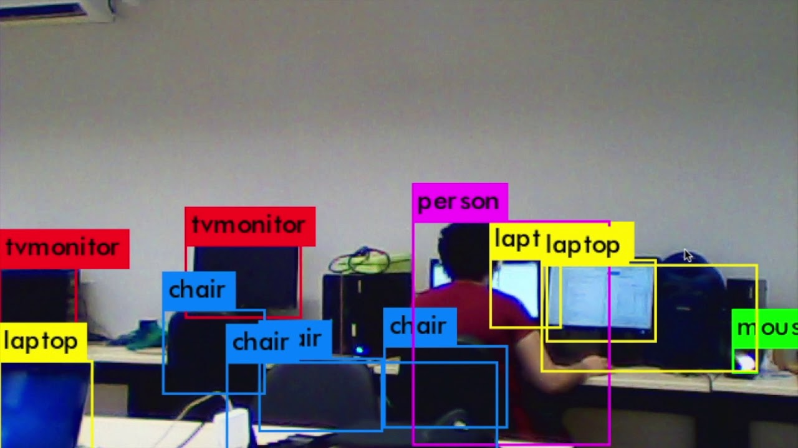

<h1>Reconhecimento de Objetos em Python</h1>

Este é um código de reconhecimento de objetos desenvolvido em Python utilizando a biblioteca OpenCV.

<h2>Descrição do Projeto</h2>

O reconhecimento de objetos é uma tarefa fundamental em visão computacional e inteligência artificial. Este código utiliza algoritmos de aprendizado de máquina para identificar e classificar objetos, aqui foi utilizado canecas e logos como teste, em imagens ou vídeos (através da webcam).

<h2>Funcionalidades</h2>
<ul>
    <li><strong>Detectar objetos em imagens:</strong> O código é capaz de identificar e delimitar objetos em imagens estáticas.</li>
    <li><strong>Reconhecimento em tempo real:</strong> Pode ser utilizado para reconhecimento de objetos em tempo real através de câmeras.</li>
    <li><strong>Classificação de objetos:</strong> Além de detectar objetos, o código pode classificá-los em categorias pré-definidas.</li>
    <li><strong>Facilidade de uso:</strong> O código é fácil de entender e modificar, permitindo personalizações conforme necessário.</li>
</ul>

<h2>Como Utilizar</h2>

Para utilizar este código, siga estas etapas:

<ol>
    <li>Baixe o código-fonte ou clone este repositório:</li>
    <pre><code>git clone https://github.com/GiooEsteves/reconhecimento_Objetos.git</code></pre>
    <li>Instale as dependências necessárias, como OpenCV e outras bibliotecas Python, utilizando o pip:</li>
    <pre><code>pip install opencv-python</code></pre>
    <li>Execute o código fornecido:</li>
    
Para identificar canecas

    <pre><code>python teste_canecas.py</code></pre>
    
Para identificar logos

    <pre><code>python teste_logo.py</code></pre>
    
Para identificar canecas e logos através da webcam

    <pre><code>python teste_webcam.py</code></pre>
</ol>

<h2>Licença</h2>

Este projeto está licenciado sob a <a href="LICENSE">Licença MIT</a>.

